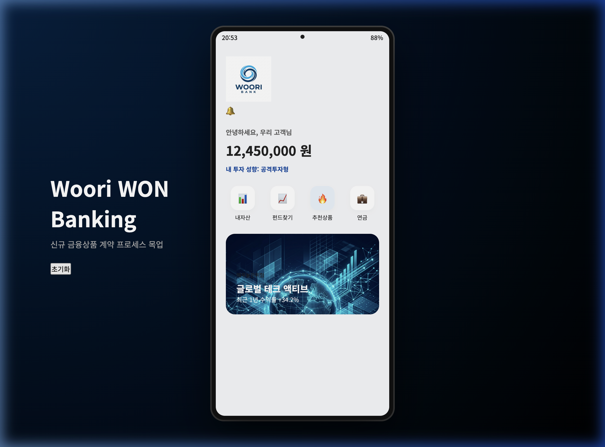
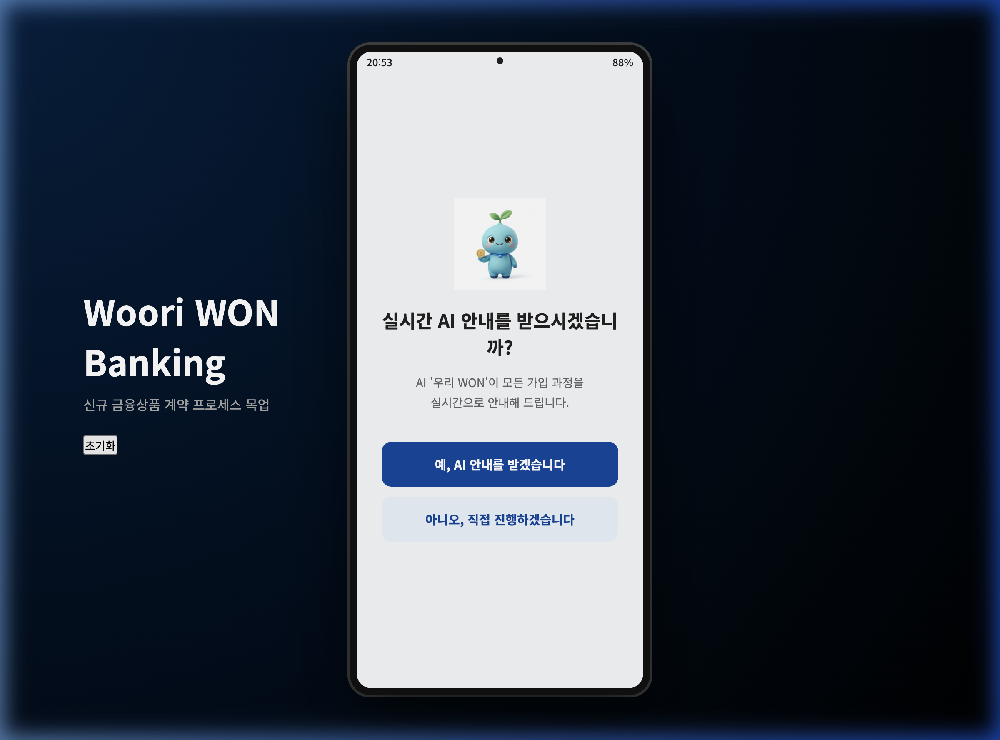
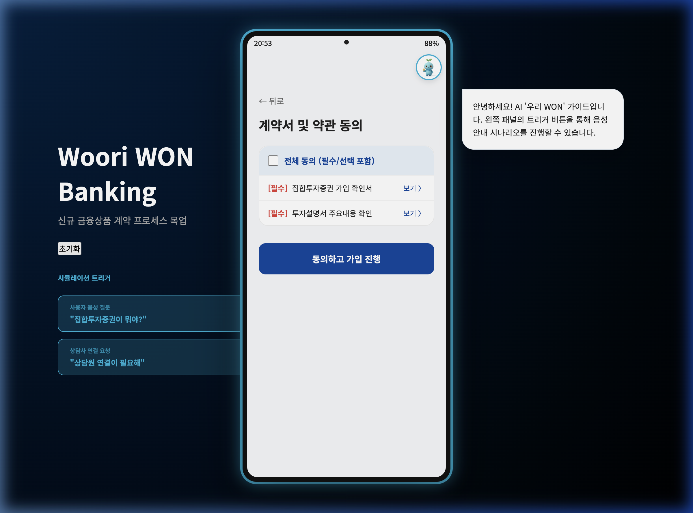
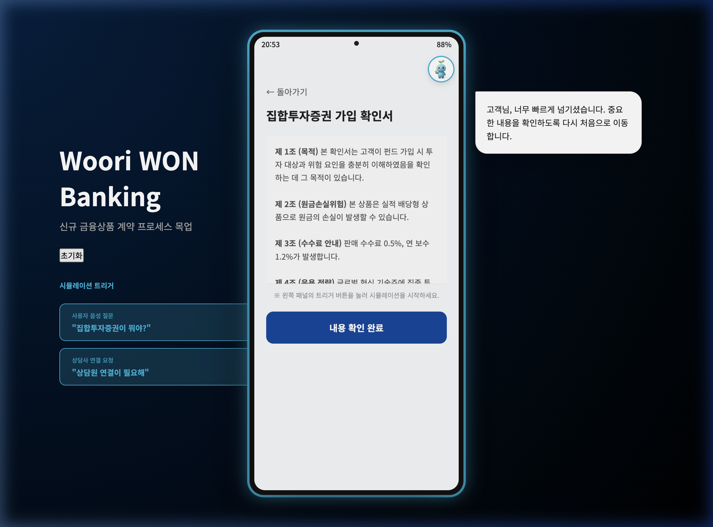
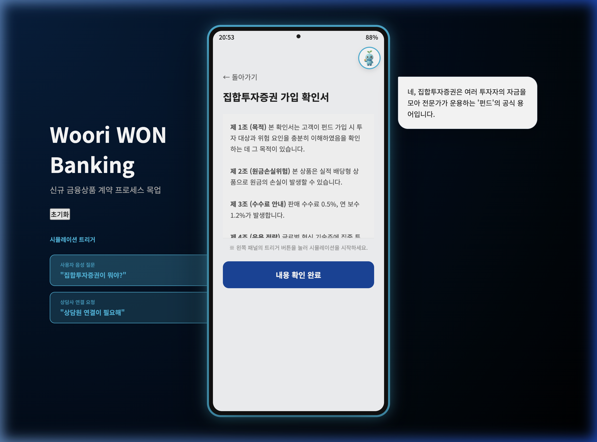
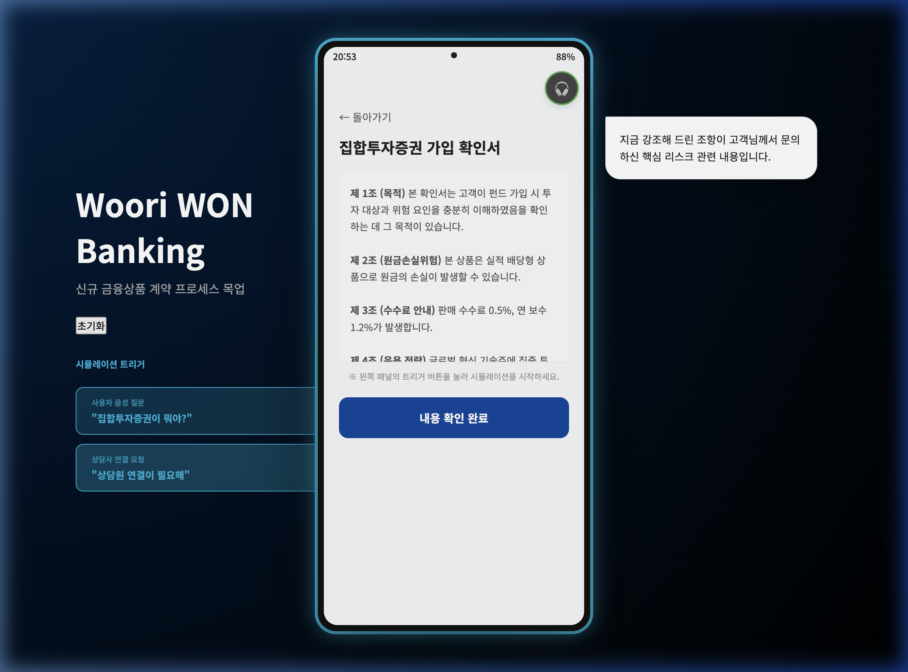
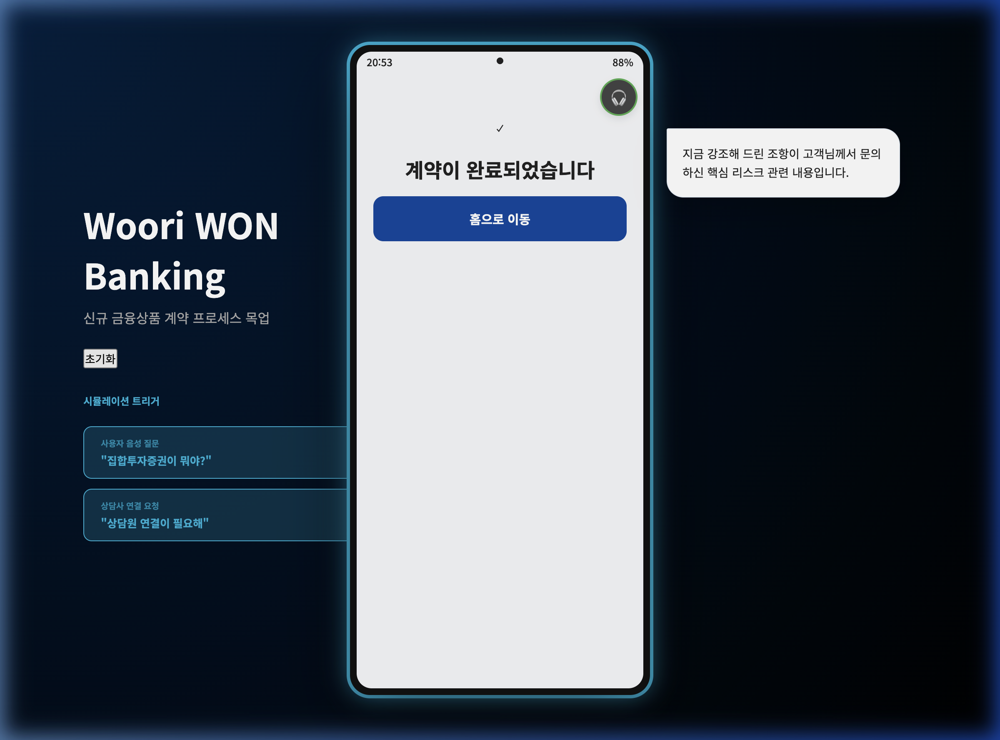

# Woori AI Guidance Mockup

본 문서는 투자 상품 가입 프로세스에 적용된 **실시간 AI 안내 및 상담사 협업 시스템** 목업의 주요 기능과 흐름을 정리한 최종 보고서입니다.

## 1. 프로젝트 개요
사용자가 고위험 투자 상품을 가입할 때, AI와 인간 상담사가 실시간으로 협력하여 안전한 계약 체결을 돕는 차세대 뱅킹 경험을 시뮬레이션합니다.

## 2. 주요 기능 및 디자인
- **Galaxy Device System**: 삼성 갤럭시 스타일의 디바이스 프레임과 상태 표시줄 적용.
- **AI Guided Mode**: 푸른색 테두리 글로우와 상단 상태 라벨로 가이드 활성화 상태 시각화.
- **Strict Compliance (Scroll Reset)**: 계약서 속독 방지를 위한 스크롤 감지 및 강제 상단 이동 기능.
- **Dual Voice Layer**: 모바일 외부(우측)에 배치된 사용자/AI 보이스 말풍선으로 외부 지원 레이어 강조.
- **Agent Remote Support**: 상담원 전환 시 아이콘 변경(헤드셋) 및 화면 내 중요 항목 실시간 하이라이트.

## 3. 핵심 프로세스 및 시연 화면

### 3.1 홈 화면 및 상품 진입

*풍부한 자산 정보와 투자 상품 배너가 포함된 메인 페이지입니다.*

### 3.2 AI 안내 활성화 초대

*AI 캐릭터 '우리 WON'이 가입 절차 안내를 제안합니다.*

### 3.3 현실적인 약관 동의 리스트

*전체 동의 및 필수/선택 항목이 구분된 실제 뱅킹 표준 UI입니다.*

### 3.4 준법 감시 (스크롤 리셋)

*빠른 스크롤 시 AI 경고 후 화면이 맨 위로 자동 리셋됩니다.*

### 3.5 양방향 음성 상담 시뮬레이션

*사용자의 질문(우측 하단)에 대해 AI가 보이스로 답변(우측 상단)합니다.*

### 3.6 상담사 원격 안내 및 하이라이트

*상담사 연결 시 원격으로 중요 조항(제 2조)을 시각적으로 강조합니다.*

### 3.7 가입 완료

*모든 안내와 확인을 거쳐 안전하게 가입이 완료된 화면입니다.*

## 4. 시연 영상 (Full Demo)
전체 가입 프로세스를 담은 녹화 영상입니다.

<video src="./mockup_recording.mov" controls width="100%"></video>

[🔗 시연 영상 직접 보기 (GitHub에서 재생되지 않을 경우 클릭)](./mockup_recording.mov)

## 5. 시연 조작 방법 (트리거 사용법)
1. **AI 활성화**: '예, AI 안내를 받겠습니다' 클릭.
2. **스크롤 리셋 테스트**: 약관 상세 페이지에서 스크롤바를 빠르게 아래로 드래그.
3. **음성 질문 테스트**: 좌측 패널의 **'사용자 음성 질문'** 버튼 클릭.
4. **상담사 전환 테스트**: 좌측 패널의 **'상담원 연결이 필요해'** 버튼 클릭.

